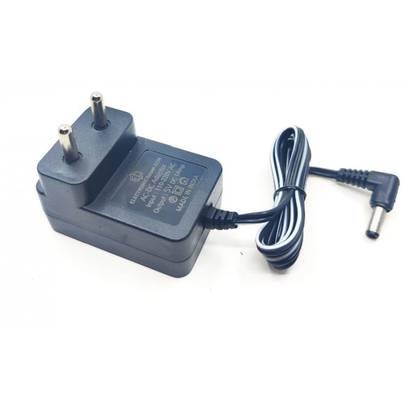

# Clean Architecture in Node using Typescript


[Clean Architecture Blog Post](https://blog.cleancoder.com/uncle-bob/2012/08/13/the-clean-architecture.html "Read About the Clean Architecture in detail, in the blog by Uncle Bob")

## Motivation to use `Clean Architecture`

**As software complexity grows , so does the overhead of one changing any of the fundamental parts in the given software .**

> One change can cause a ripple effect throughout the whole software system , leading to many changes , hence potentially many bugs , during refactoring

_A great way to manage complexity is to arrange the code into layers of abstraction ,
with the lower layers not knowing about the concrete implementation of the upper layers
, and them communicating with each other only through adapters ( abstract interfaces )._

**This way , one can easily make changes to any of the layers at any time , and
there would be no need for multilayer changes , as the shape of the adapters ( abstract interfaces ) would never be changed , and only the concrete implementation in a specific layer would be modified.**

If everything goes well in the architectural process , we end up with software layers that are independent of the specificities of the type of UI used , the concrete implementation of the Data Base used
etc ...

**i.e : We could swap out any of the concrete implementations, `the Data Base` , for example at any time , and substitute it with another implementation  ( eg Switching MongoDb with MySql ) , and there would be no change in implementation required to any of the lower layers of our application**

> What's more , every layer of our architecture can be tested independently.
>
> Thereby aiding a quick `TDD Process`

---

## Ports /  Adapters / Devices

>_A practical and useful implementation of the dependency inversion principle_

---

### 1 . Ports


_Ports are the interfaces to which adapters can connect to_

In code , it means we create an interface that specifies the function that is supposed to be performed

In the case of a charging port , it's function is to charge a device.

---

```typescript

//Port 

interface ChargeDevice{
     
//behavior

     charge(device:TDevice):void;
     
}

```

---

### 2 . Adapters




_Adapters are concrete implemantations , that are specific to the device being used. They are the link connecting a device to the port_

```typescript
//MacBook Adapter

class MacBookCharger implements ChargeDevice{

  charge(device: TDevice ): void {

      console.log("💻 💻 💻 💻 💻 💻")
      console.log("Charging : ",device.name," of pin type : ",device.pinType)
      console.log("🍎 🍎 🍎 🍏 🍏 🍏")

      for(let i =0;i<=100;i+=10)
         console.log(`Current Charge : ${i} %`)

  }
  
}
//Phone Adapter
class PhoneCharger implements ChargeDevice{

  charge(device: TDevice): void {
      console.log("📱 📱 📱  📱 📱 📱")
      console.log(`Charging : ${device.name}, \n of pin type : ${device.pinType}`)
      console.log("🤖 🤖 🤖 🤖 🤖 🤖 ")
  }

}
```

---

### 3 . Devices


_This is the concrete implementation
that plugs into the adapter in order to communicate with the port_

```typescript
In Typescript Code , this is how we'd
go about defining the Device Type 

//Device ( Entity )

 type TDevice={

  name: string,
  pinType:"2 pin"|"3 pin"

}
```

---

## The Whole Setup in Action

### `UseCase : ChargeDevice`

  | PORT | ADAPTER | DEVICE | USE CASE INSTANCE |
  |:----:|:----:|:----:|:----:|
  |ChargeDevice|MacBookCharger|MacBook|ChargeMacBook|
  |ChargeDevice|PhoneCharger|PixelPhone|ChargePhone|
  
  ---


---


```typescript

// Charging a Device
class ChargeDeviceUseCase {
     
  constructor(private readonly adapter : ChargeDevice) {}

   execute( device : TDevice){
     this.adapter.charge(device);
   }

}

const PixelPhone:TDevice={
  name:"Google Pixel",
  pinType:"3 pin"
}

const MacBook:TDevice={
  name:"MacBook Pro",
  pinType:"2 pin"
}

const PhoneAdapter = new PhoneCharger()

const MacBookAdapter = new MacBookCharger()


const ChargePhone =  new ChargeDeviceUseCase(PhoneAdapter)

ChargePhone.execute(PixelPhone)

const ChargeMacBook = new ChargeDeviceUseCase(MacBookAdapter)

ChargeMacBook.execute(MacBook)

// Output

/* 
📱 📱 📱  📱 📱 📱
Charging : Google Pixel, 
 of pin type : 3 pin
🤖 🤖 🤖 🤖 🤖 🤖 

//--------------------------------

💻 💻 💻 💻 💻 💻
Charging :  MacBook Pro  of pin type :  2 pin
🍎 🍎 🍎 🍏 🍏 🍏
Current Charge : 0 %
Current Charge : 10 %
Current Charge : 20 %
Current Charge : 30 %
Current Charge : 40 %
Current Charge : 50 %
Current Charge : 60 %
Current Charge : 70 %
Current Charge : 80 %
Current Charge : 90 %
Current Charge : 100 %
*/

```

## The Dependency Rule

> " The name of something declared in an outer circle must not be mentioned by the code in the an inner circle . That includes, functions, classes, variables, or any other named software entity. "
>
>Data formats used in an outer circle should not be used by an inner circle. We don’t want anything in an outer circle to impact the inner circles.
>
> -- Uncle Bob

It is imperative that we ensure that none of the structures in the inner layers can know about any of the outer layers, but the outer layers `can and should` know about the inner layers .

In other words , `Source code dependencies can only point inwards , and not outwards`

i.e  It is ok for `UseCase` structures to know about `Entities` , but it's not ok the other way around .

However , the communication between the different layers will always take place through interfaces , and never directly.

This objective is easily achieved by applying the `Dependency Inversion Principle`

---

## Setting up a `Node.js + Typescript` project with `Clean Architecture`

### Steps

1. Initiate node project using `npm init -y` , which will create the `package.json` file with the default settings.

1. Create folders `src` and `test`.
  
1. Integrate typescript into the project by using `npm i -D typescript @types/node` , which installs typescript as a dev dependency , and the node type declarations to make working with node using typescript compatible.

1. To initialize all the tooling for this typescript node project, run `npx tsc --init` , which will create the `tsconfig.json` file with the default settings.

1. Within the newly created tsconfig.json file, go to `outDir` option , and select the folder to which the compiled javascript compiled will be put into. We choose a folder name `dist` for this purpose _( you could name it whatever you want )_.

    ```json
    "outDir": "./dist"
    ```

1. Next set up the `baseUrl` option in the `tsconfig.json` file to be `src`.

    ```json
     "baseUrl": "./src"
    ```

1. Next set the directory references using `paths` attribute in the tsconfig.json file, which will allow us to easily reference different files in our project.
All these modules will be set in reference to the `baseUrl (i.e : src)` in our particular case

    >This is how we'll be able to reference files in our project after setting up the `paths` attribute eg : `import CreateUserUseCase from'@application/useCases/CreateUserUseCase'` rather than using something like `import CreateUserUseCase from './src/application/useCases/CreateUserUseCase'`

      ```json
      "paths": {
      "@domain/_":["domain/_"],
      "@application/_":["application/_"],
      "@infrastructure/_":["infrastructure/_"],
      "@main/_":["main/_"],
      "@test/_":["../test/_"],
    }
      ```

    > In this above code block , we set 5 different    directory references for 5 folders we are about to create in the next few steps.  
    >
    >Keep in mind that all of these folders are placed relative to the `baseUrl (i.e. ./src)` , in our case .
    >
    >So, for example the `@test` reference will refer to the test folder inside our project , which is one folder above our src folder , hence this `["../test/_"]` is how we specify it's relative position w.r.t our `baseUrl (src)`.
    >
    >`domain` , `application` and `infrastructure` are the 3 separate layers in our clean architecture setup .
    >
    >The `main` layer serves as the entry point for our application , and will have the `server.ts` file , which would start out application.
    >
    >Finally the `test` layer will contain all our `unit` and `integration` test files.

1. Next , go on and create all the above mentioned folders in the src folder `domain` , `application` , `infrastructure` , `main` , and also create a `server.ts` file within the `main` folder. The `test` folder will be created outside the src folder.

1. Now , we need to specify `rootDirs` attribute in the `tsconfig.json` file , which specifies where all the typescript files would be located in our project.
This would have our `src` and `test` folder , which  contain all our typescript files.

    ```json
        "rootDirs": [
              "src",
              "test"
            ]
    ```

1. Next we specify the folders that we want to be included for the compilation process during `development`, and  the `build` phase. During the development phase , it makes sense to include the `test` files for compilation.So, go to the `include` attribute in the `tsconfig.json` file, and include the `src` and `test` folders .

    ```json
        "include": [
            "src",
            "test"
          ]
     ```

1. However, the `test` files  should be excluded in the `build` phase , as test files are not useful for deployment purposes.

      - For this we will create an extra `tsconfig` file by the name of : `tsconfig-build.json` ( the configuration for the build phase ) , which will inherit all the configuration from the `tsconfig.json` file, but will exclude the `test` files for compilation during `build` time.

         ```json
            {
              "extends":"./tsconfig.json",
              "exclude": ["test"]
            }
         ```

1. Next , we update our `package.json` file to use the compiled `javascript` files for running the application, by setting the `main` attribute in `package.json` to `dist/main/server.js` , so that our node app uses `server.js` to run the application.

      ```json
       "main": "dist/main/server.js"
      ```

1. Now we install the `rimraf` package (dev dependency) ( used to remove the older `dist` folder before creating a new one ) , to help us during the build process  `npm i -D rimraf`. And then we write our build script using this package.

    ```json
      "build": "rimraf dist && tsc -p tsconfig-build.json",
    ```

    >The `rimraf` package provides a cross-platform solution for deleting files and folders, which can be useful if you are working on a project that needs to run on multiple operating systems.
    >
    > By running the build command, we are able to  compile fresh files and folders using the typescript configurations for build time ( which does not include unnecessary files like `test` by using the `tsconfig-build.json` file )

1. For the build process to recognize the reference to our files defined in the  `paths` property of the project , we need to install a package known as `module-alias` to our project as a production dependency.

      ```json
      npm i module-alias
      ```

1. Next, for our build to recognize the reference to our files defined in the `paths` property of our `tsconfig-build.json` , we import `module-alias/register` at the top of the `server.ts` file in the `main` folder inside the `src` directory.

    ```typescript
     \\serve.ts
     
     import 'module-alias/register';

    ```

1.For the `module-alias` package to recognize our defined package structure during build time, our files defined in the `paths` property of our `tsconfig-build , we need to create a similar mapping in our package.json file .
