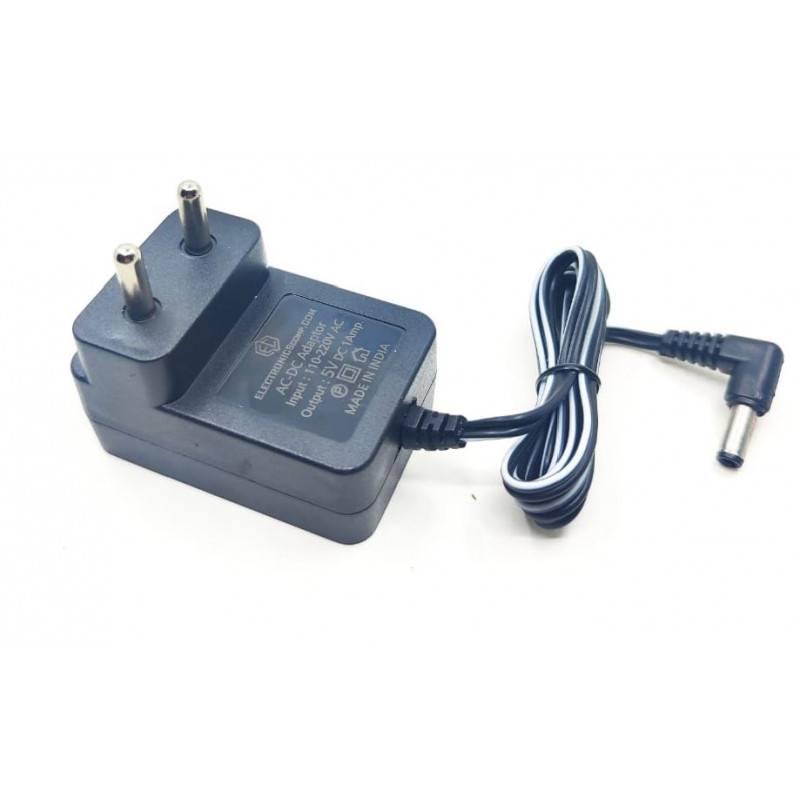

# Clean Architecture in Node using Typescript

## Motivation to use the Clean Architecture

**As software complexity grows , so does the overhead of one changing any of the fundamental parts in the given software .**

> One change can cause a ripple effect throughout the whole software system , leading to many changes , hence potentially many bugs , during refactoring

_A great way to manage complexity is to arrange the code into layers of abstraction ,
with the lower layers not knowing about the concrete implementation of the upper layers
, and them communicating with each other only through adapters ( abstract interfaces )._

**This way , one can easily make  changes to any of the layers any time , and
there would the need of multilayer changes , as the shape of the adapters ( abstract interfaces ) would never be changed , and only the concrete implementation in a specific layer would be modified.**

If everything goes well in the architectural process , we end up with software layers that are independent of the specificities of the type of UI used , the concrete implementation of the Data Base used
etc ...

**i.e : We could swap out any of the concrete implementations, `the Data Base` , for example at any time , and substitute it with another implementation  ( eg Switching MongoDb with MySql ) , and there would be no change in implementation required to any of the lower layers of our application**

> What's more , every layer of our architecture can be tested independently.
>
> Thereby aiding a quick `TDD Process`

---

## Ports /  Adapters / Plugs

### Ports

1. Ports are the interfaces that allow the communication between different layers.

---

### Adapters

1. Adapters are the the classes , whose constructor has a way to plug the implementation ( whose type is the Port interface type)

---

### Plugs

