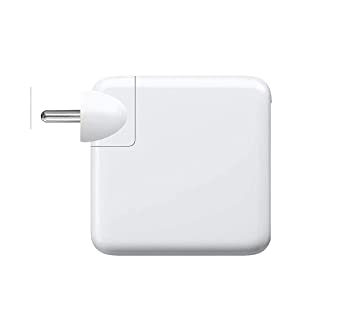

# Clean Architecture in Node using Typescript


[Clean Architecture Blog Post](https://blog.cleancoder.com/uncle-bob/2012/08/13/the-clean-architecture.html "Read About the Clean Architecture in detail, in the blog by Uncle Bob")

## Motivation to use `Clean Architecture`

**As software complexity grows , so does the overhead of one changing any of the fundamental parts in the given software .**

> One change can cause a ripple effect throughout the whole software system , leading to many changes , hence potentially many bugs , during refactoring

_A great way to manage complexity is to arrange the code into layers of abstraction ,
with the lower layers not knowing about the concrete implementation of the upper layers
, and them communicating with each other only through adapters ( abstract interfaces )._

**This way , one can easily make  changes to any of the layers any time , and
there would the need of multilayer changes , as the shape of the adapters ( abstract interfaces ) would never be changed , and only the concrete implementation in a specific layer would be modified.**

If everything goes well in the architectural process , we end up with software layers that are independent of the specificities of the type of UI used , the concrete implementation of the Data Base used
etc ...

**i.e : We could swap out any of the concrete implementations, `the Data Base` , for example at any time , and substitute it with another implementation  ( eg Switching MongoDb with MySql ) , and there would be no change in implementation required to any of the lower layers of our application**

> What's more , every layer of our architecture can be tested independently.
>
> Thereby aiding a quick `TDD Process`

---

## Ports /  Adapters / Devices

>_A practical and useful implementation of the dependency inversion principle_

---

### 1 . Ports


_Ports are the interfaces to which adapters can connect to_

In code , it means we create an interface that specifies the function that is supposed to be performed

In the case of a charging port , it's function is to charge a device.

---

```typescript

//Port 

interface ChargeDevice{
     
//behavior

     charge(device:TDevice):void;
     
}

```

---

### 2 . Adapters




_Adapters are concrete implemantations , that are specific to the device being used. They are the link connecting a device to the port_

```typescript
//MacBook Adapter

class MacBookCharger implements ChargeDevice{

  charge(device: TDevice ): void {

      console.log("💻 💻 💻 💻 💻 💻")
      console.log("Charging : ",device.name," of pin type : ",device.pinType)
      console.log("🍎 🍎 🍎 🍏 🍏 🍏")

      for(let i =0;i<=100;i+=10)
         console.log(`Current Charge : ${i} %`)

  }
  
}
//Phone Adapter
class PhoneCharger implements ChargeDevice{

  charge(device: TDevice): void {
      console.log("📱 📱 📱  📱 📱 📱")
      console.log(`Charging : ${device.name}, \n of pin type : ${device.pinType}`)
      console.log("🤖 🤖 🤖 🤖 🤖 🤖 ")
  }

}
```

---

### 3 . Devices


_This is the concrete implementation
that plugs into the adapter in order to communicate with the port_

```typescript
In Typescript Code , this is how we'd
go about defining the Device Type 

//Device ( Entity )

 type TDevice={

  name: string,
  pinType:"2 pin"|"3 pin"

}
```

---

## The Whole Setup in Action

### `UseCase : ChargeDevice`

  | PORT | ADAPTER | DEVICE | USE CASE INSTANCE |
  |:----:|:----:|:----:|:----:|
  |ChargeDevice|MacBookCharger|MacBook|ChargeMacBook|
  |ChargeDevice|PhoneCharger|PixelPhone|ChargePhone|
  
  ---


---


```typescript

// Charging a Device
class ChargeDeviceUseCase {
     
  constructor(private readonly adapter : ChargeDevice) {}

   execute( device : TDevice){
     this.adapter.charge(device);
   }

}

const PixelPhone:TDevice={
  name:"Google Pixel",
  pinType:"3 pin"
}

const MacBook:TDevice={
  name:"MacBook Pro",
  pinType:"2 pin"
}

const PhoneAdapter = new PhoneCharger()

const MacBookAdapter = new MacBookCharger()


const ChargePhone =  new ChargeDeviceUseCase(PhoneAdapter)

ChargePhone.execute(PixelPhone)

const ChargeMacBook = new ChargeDeviceUseCase(MacBookAdapter)

ChargeMacBook.execute(MacBook)

// Output

/* 
📱 📱 📱  📱 📱 📱
Charging : Google Pixel, 
 of pin type : 3 pin
🤖 🤖 🤖 🤖 🤖 🤖 

//--------------------------------

💻 💻 💻 💻 💻 💻
Charging :  MacBook Pro  of pin type :  2 pin
🍎 🍎 🍎 🍏 🍏 🍏
Current Charge : 0 %
Current Charge : 10 %
Current Charge : 20 %
Current Charge : 30 %
Current Charge : 40 %
Current Charge : 50 %
Current Charge : 60 %
Current Charge : 70 %
Current Charge : 80 %
Current Charge : 90 %
Current Charge : 100 %
*/

```

## The Dependency Rule

> " The name of something declared in an outer circle must not be mentioned by the code in the an inner circle . That includes, functions, classes, variables, or any other named software entity. "
>
>Data formats used in an outer circle should not be used by an inner circle. We don’t want anything in an outer circle to impact the inner circles.
>
> -- Uncle Bob

It is imperative that we ensure that none of the structures in the inner layers can know about any of the outer layers, but the outer layers `can and should` know about the inner layers .

In other words , `Source code dependencies can only point inwards , and not outwards`

i.e  It is ok for `UseCase` structures to know about `Entities` , but it's not ok the other way around .

However , the communication between the different layers will always take place through interfaces , and never directly.

This objective is easily achieved by applying the `Dependency Inversion Principle`
